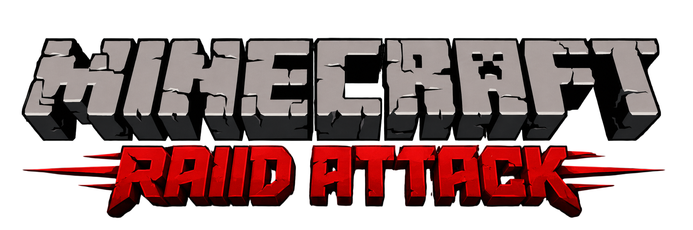

<div align="center">



**RaidAttack** is a Minecraft plugin that runs on **Java** and supports **Bedrock** (via Geyser).

<!-- Version badge reads the latest git tag — no hard-coded version. -->


</div>

---

## What it is

A first-party Paper plugin that turns a survival server into a base-building, raiding PvP game:
claim your land, defend it with turrets, team up in alliances, and raid other players' claims for
loot. Accounts are Discord-gated and span both editions, and Bedrock players get a native,
re-skinned in-game menu through Geyser + Floodgate.

- **Home protection** — claimable zones, friends/rights, home teleport, anti-spawn-camp spawn area.
- **Turrets** — deployable, upgradeable auto-defense (4 slots per claim).
- **Raids** — attack other claims on a timer, steal loot, defend to earn bonuses; on Bedrock you pick
  the raid size (diamonds + emeralds spent → raiders + total spawns) on an in-game slider.
- **Alliances** — teams with leaders, join requests, colors, and alliance-only chat.
- **Quests** — per-player achievements with progress tracking and a grand reward.
- **Seasons & moderation** — UTC-gated event unlocks, plus `/ban` · `/kick` · `/unban`.
- **World border** — configurable square border (`worldborder-size`); the Nether border is auto-set
  to 1/8 of it, so a player can't portal "behind" the overworld edge.
- **Bedrock UI** — the `/ra` menu rendered as native Bedrock forms (see [`bedrock-pack/`](bedrock-pack/)).

## Version

The version has **one source of truth**: `version` in
[`plugins-src/RaidAttack/build.gradle.kts`](plugins-src/RaidAttack/build.gradle.kts). It is injected
into `plugin.yml` at build time (`@pluginVersion@` token) and the Bedrock pack mirrors it — so it is
never hard-coded anywhere else. The plugin version **mirrors the Minecraft version it targets** and is
bumped in lockstep with the server's MC/Paper build.

## Dependencies

**Platform / toolchain**

| Dependency | Version | Role |
|---|---|---|
| Paper | matches the project version (see `build.gradle.kts`), build #64 | server software (Minecraft, same version) |
| Java | `25` | runs Paper (26.1+ requires 25+) and the compile toolchain |
| Java | `21` | runs the Gradle daemon only (it won't start on 25) |
| Gradle | `9.0.0` | build (via the wrapper) |

**Third-party plugins** (versions track the MC/Paper build)

| Plugin | Why |
|---|---|
| [Citizens](https://www.spigotmc.org/resources/citizens.13811/) | NPC framework for turret & raid NPCs (the version-sensitive one — `2.0.42`/b4180 supports up to 26.1.x) |
| [SkinsRestorer](https://www.spigotmc.org/resources/skinsrestorer.2124/) | restores skins on this offline-mode server |
| [Geyser](https://geysermc.org/) (Geyser-Spigot) | lets Bedrock clients connect (UDP `19132`) |
| [Floodgate](https://geysermc.org/) | stable Bedrock identity + the API for dual-username accounts |

**Runtime libraries** (downloaded by Paper from Maven Central — declared in `plugin.yml`, no fat jar)

| Library | Version | Role |
|---|---|---|
| `org.postgresql:postgresql` | `42.7.4` | JDBC driver for the auth + world databases |
| `com.zaxxer:HikariCP` | `5.1.0` | connection pool |
| `org.mindrot:jbcrypt` | `0.4` | verifies the BCrypt password hashes the Discord bot writes |

**Data store** — PostgreSQL (one `raidattack` database; `public` schema for Discord-gated auth,
`world` schema for gameplay state). The plugin's only on-disk file is `config.yml`.

## Build

```bash
cd plugins-src/RaidAttack
JAVA_HOME=/usr/lib/jvm/java-21-openjdk-amd64 ./gradlew deploy
```

`deploy` compiles with the Java 25 toolchain and copies `RaidAttack.jar` into the server's
`plugins/`. Bukkit only loads jars at startup, so restart the server afterwards. Full stack,
server config, and the build → deploy → restart workflow live in [`CLAUDE.md`](CLAUDE.md);
the dependency inventory is in [`DEPENDENCIES.md`](DEPENDENCIES.md).

## Layout

```
plugins-src/RaidAttack/   the plugin (Gradle project; com.raeyd.raidattack)
bedrock-pack/             Bedrock resource pack — re-skins the /ra menu (served via Geyser)
docs/                     third-party plugin set & notes
images/                   logo / icons
```
